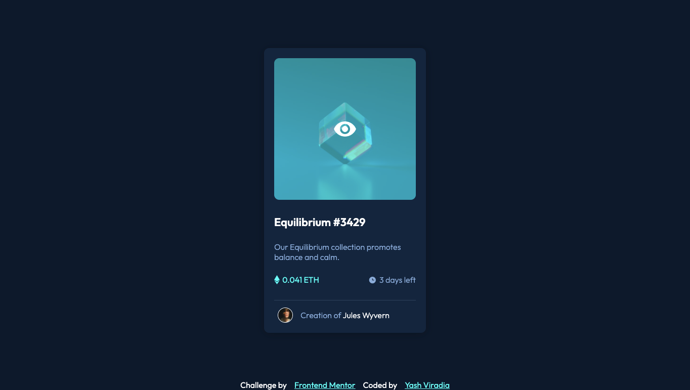

# NFT preview card component 
This is a solution to the [NFT preview card component challenge on Frontend Mentor](https://www.frontendmentor.io/challenges/nft-preview-card-component-SbdUL_w0U).

## Table of contents

- [Overview](#overview)
  - [The challenge](#the-challenge)
  - [Screenshot](#screenshot)
  - [Links](#links)
- [My process](#my-process)
  - [Built with](#built-with)
  - [What I learned](#what-i-learned)
  - [Continued development](#continued-development)
  - [Useful resources](#useful-resources)
- [Author](#author)
- [Acknowledgments](#acknowledgments)


## Overview

### The challenge

Users should be able to:

- View the optimal layout depending on their device's screen size
- See hover states for interactive elements

### Screenshot



### Links

- Solution URL: [https://www.frontendmentor.io/solutions/nft-preview-card-component-rkrAJ9N79](https://www.frontendmentor.io/solutions/nft-preview-card-component-rkrAJ9N79)
- Live Site URL: [https://yashviradia.github.io/nft-preview-card-component-main/](https://yashviradia.github.io/nft-preview-card-component-main/)

## My process

### Built with

- Semantic HTML5 markup
- CSS custom properties
- Flexbox


### What I learned

- working this project with help of CSS Flexbox.
- create image hover overlay effects using CSS
- Using z-index.

```css
.overlay {
  position: absolute;
  top: 0;
  bottom: 0;
  left: 0;
  right: 0;
  height: 100%;
  width: 100%;
  opacity: 0;
  transition: 0.5s ease;
  border-radius: 10px;
  background-color: hsl(178, 100%, 50%);
  align-items: center;
  justify-content: center;
  cursor: pointer;
  z-index: 1;
}
```


### Continued development

- Using HTML psuedo Elements to create hover effect on card image.
- Blog describing the process of building this project.

### Useful resources

- [Flexbox Explanation on MDN](https://www.example.com) - This is an amazing documentation on CSS Flexbox which helped me finally understand this concept. I'd recommend it to anyone still learning this concept.

## Author

- Website - [Yash Viradia](https://www.your-site.com)
- Frontend Mentor - [@yashviradia](https://www.frontendmentor.io/profile/yashviradia)
- Twitter - [@theyashviradia](https://twitter.com/theyashviradia)


## Acknowledgments

- Detailed review from [Grace Snow](https://app.slack.com/client/TCYEB44S2/D03AHU8UF2L/user_profile/U01D6CR3C68) on Slack.
- Feedback from [Michael Bishop](https://www.frontendmentor.io/profile/MikeBish13) on Frontend Mentor.
